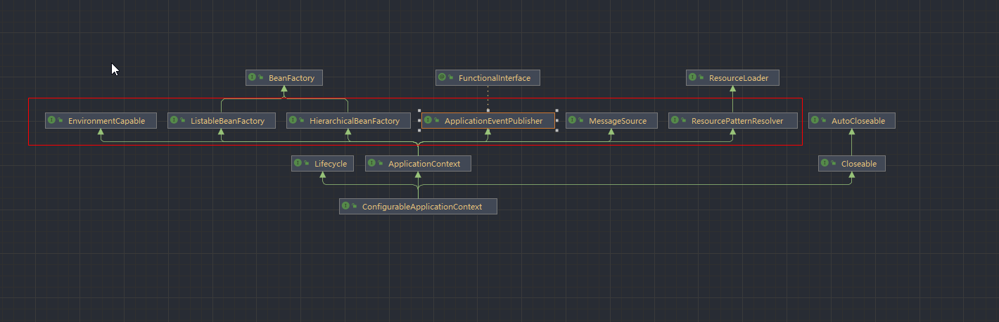
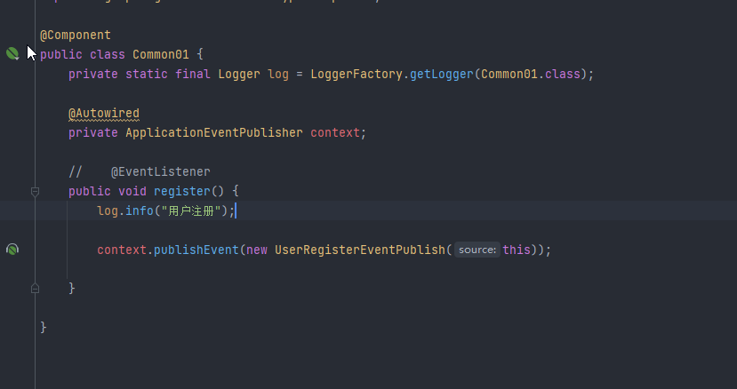
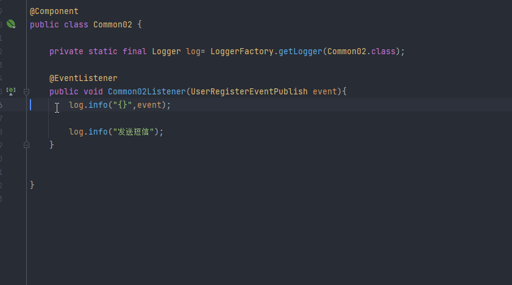
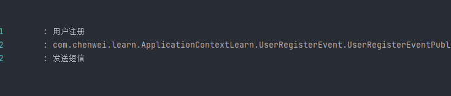

# ApplicationContext源码与应用




## 1.MessageSource

**作用**：国际化


## 2.ResourcePatternResolver

**作用**：根据通配符获取一组资源

```java
        //获取目录下spring配置文件
        Resource[] resources = context.getResources("classpath*:META-INF/spring.factories");
        for (Resource resource : resources) {
            System.out.println(resource);
        }
```


## 3.EnvironmentCapable

**作用**：获取配置信息(环境变量,配置文件(properties、yml等))

```java
        //获取配置信息
        ConfigurableEnvironment environment = context.getEnvironment();
        System.out.println(environment.getProperty("java_home"));
        System.out.println(environment.getProperty("spring.application.name"));
        System.out.println(environment.getProperty("server.port"));

```


## 4.ApplicationEventPublisher

**作用**：发送事件


```
//        context.publishEvent(new UserRegisterEventPublish(context));


​        Common01 common01Bean = context.getBean(Common01.class);
​        common01Bean.register();
```





